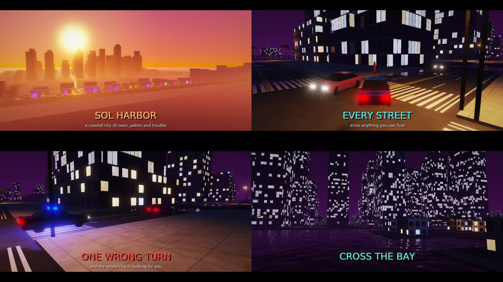
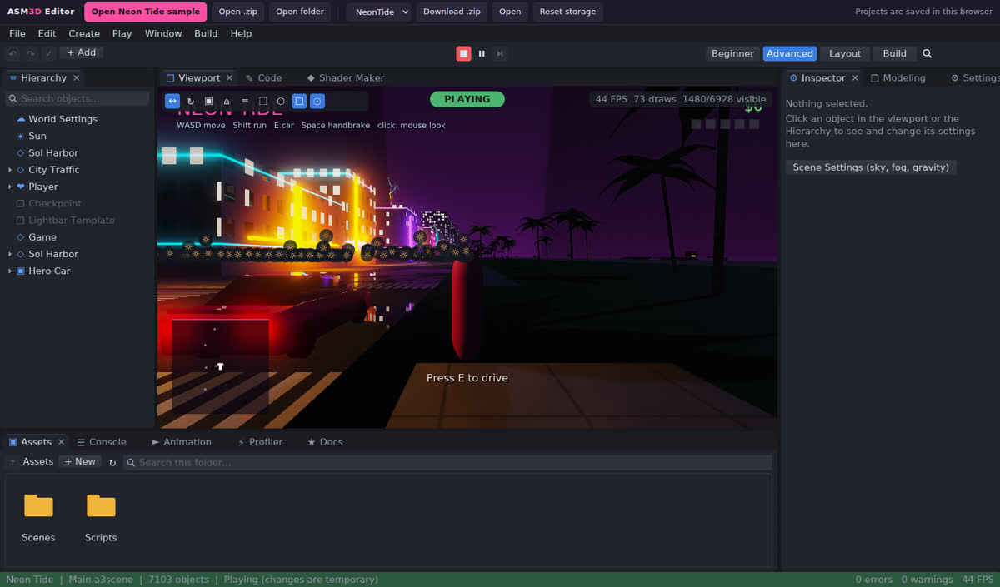

# ASM3D

ASM3D is a desktop game engine and editor written in C11. The hot paths are
x86-64 assembly: SIMD math, frustum culling, the physics integrator,
broadphase, solver and raycasts, the audio mixer, particle simulation and
the modeling kernels (polygon modeling in the editor: [docs/MODELING.md](docs/MODELING.md)).
Gameplay is written in A3Script, the engine's own scripting language
([docs/SCRIPTING.md](docs/SCRIPTING.md)). The engine and editor have no third-party
code or libraries (only the OS windowing API and OpenGL from the system). It runs on Windows and Linux.

See [docs/STATUS.md](docs/STATUS.md) for exactly what works today.
`asm3d_cli` exposes the engine to scripts, CI and AI assistants with JSON
output ([docs/CLI.md](docs/CLI.md)).

**Neon Tide** (`games/NeonTide`) is an open-world example game made with
ASM3D: a procedural coastal city at night, cars you can take, traffic,
courier jobs and police chases ([docs/CITY.md](docs/CITY.md)). Open the folder
in the editor and press F5, or run `./build/asm3d_player --project games/NeonTide`.



The editor also runs in a **browser** (WebAssembly + WebGL2, same code):
build, serve `build/web/` and open it ([docs/WEB_EDITOR.md](docs/WEB_EDITOR.md)).



## Windows

Download a release zip, extract it, and run `asm3d_editor.exe`. To build it yourself:

- **On Windows (MSYS2 MinGW64 shell):** `pacman -S mingw-w64-x86_64-gcc mingw-w64-x86_64-cmake mingw-w64-x86_64-ninja`,
  then `cmake -S . -B build -G Ninja -DCMAKE_BUILD_TYPE=Release && cmake --build build`.
- **Cross-compile from Linux:** `sudo apt install mingw-w64`, then
  `cmake -S . -B build-win -G Ninja -DCMAKE_TOOLCHAIN_FILE=cmake/mingw-w64.cmake -DCMAKE_BUILD_TYPE=Release && cmake --build build-win`.

The `.exe` files are statically linked, so no DLLs need to be shipped alongside them.

## Build (Linux)

Requirements: CMake 3.16+, a C11 compiler (gcc or clang), Ninja or Make, the X11
development headers and an OpenGL 3.3 driver.

```sh
cmake -S . -B build -G Ninja -DCMAKE_BUILD_TYPE=Release
cmake --build build
```

## Run

```sh
./build/asm3d_editor                   # editor (start screen)
./build/asm3d_editor --project MyGame  # open a project
./build/asm3d_player --demo            # renderer demo scene
```

In the editor, pick a template, press **F5** to play, and use
**Build > Build Game** to package it. The result is
`MyGame/Builds/Desktop-Debug/MyGame/`, a folder holding the game program and a
`data/` folder. Zip that folder to share the game.

## Test

```sh
./build/asm3d_tests                                   # native (assembly kernels)
node tools/run_wasm_tests.mjs build/asm3d_tests.wasm  # WebAssembly (C kernels)
./build/asm3d_editor --selftest                       # editor end to end (needs a display)
python3 tools/test_cli.py build/asm3d_cli             # command-line tool end to end
node tools/test_web_editor.mjs build/web --selftest   # browser editor (Playwright + Chromium)
```

## Layout

```
engine/core      memory, math, SIMD (asm + C), strings, JSON, images, hashing
engine/platform  Win32 / POSIX / web platform layers, Win32 and X11 windows
engine/ecs       entities, components, reflection
engine/scene     built-in components, scene files
engine/physics   rigid bodies, colliders, character controller, vehicles, x86-64 kernels
engine/audio     mixer (x86-64 kernels), WAV, WASAPI / ALSA output
engine/particles emitters, x86-64 integration kernel
engine/anim      keyframe clips, Animator, Motion
engine/script    A3Script compiler, VM, standard library, engine bindings, HUD
engine/modeling  editable polygon meshes and modeling tools, x86-64 kernels
engine/world     procedural city, procedural meshes, traffic
engine/render    RHI (OpenGL / null), PBR renderer, shader graph compiler
engine/ui        immediate-mode UI toolkit, docking
engine/runtime   engine loop, systems, modules
apps/editor      the editor
apps/player      the game player (built games are this program + data/)
apps/cli         asm3d_cli, the JSON command-line tool
web              the browser editor page, WebGL2 bindings, file system (build/web)
games/NeonTide   the open-world example game (scenes rebuilt by tools/make_neon_tide.sh)
tests            unit, determinism and scenario tests
```
